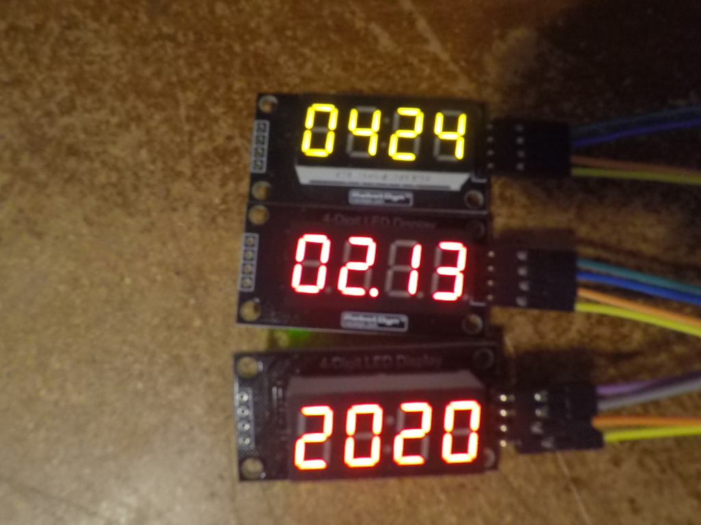
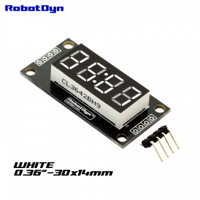
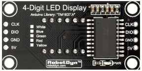

TM1637
========

Python files for TM1637 7-segment display module for Beaglebone Black. Supports Alpha and Numeric and decimal characters.

| Board pin name | Board pin | Beaglebone Black pin name |
|----------------|-----------| --------------------------|
| CLK            | 1         | P9\_12, GPIO              |
| DIO            | 2         | P9\_23, GPIO              |
| GND            | 3         | External Power, Ground    |
| 5v             | 4         | External Power, VDD\_5v   |

