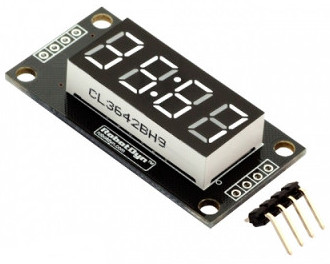
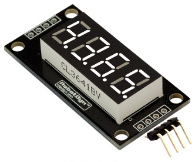

TM1637
========

Python files for TM1637 7-segment display module for Beaglebone Black. Supports Alpha and Numeric and decimal characters.

Note: because of the need to use an external power source for this module, you must share the ground from the power source and the Beagblebone Black other wise the module will not comunicate properly

| Board pin name | Board pin | Beaglebone Black pin name |
|----------------|-----------| --------------------------|
| CLK            | 1         | P9\_12, GPIO              |
| DIO            | 2         | P9\_23, GPIO              |
| GND            | 3         | External Power, Ground    | <-- must be shared with Beaglebone Black
| 5v             | 4         | External Power, VDD\_5v   |

